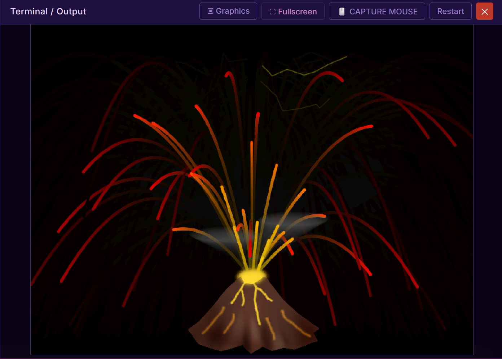
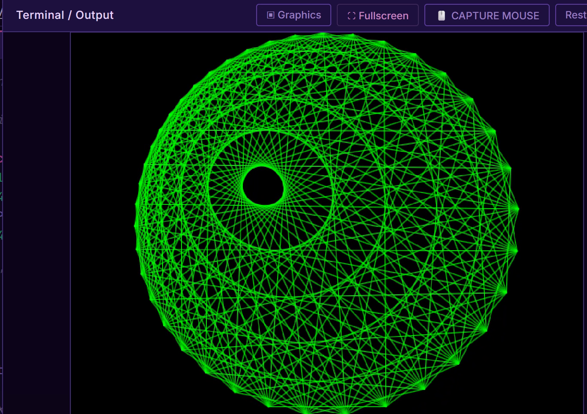

# basicFusion
Trying some basic programming using the [basicFusion app/website](https://www.basicfusion.org/)

## A first test

Using the built-in Spriteshop and retro font editor

Run and view the code using this link:

[https://basicfusion.org/index.html?open=cloud/2d186f43](https://basicfusion.org/index.html?open=cloud/2d186f43)

A still image from the animation:

The code:
[tube.bf](tube.bf)

## Volcano

This program uses an external image file which is loaded via an url, can also be a local path.

The animation of lava and clouds uses a nearly transparent black overlay which is applied every couple of frames. It gradually fades old image content to black.

This cloud link should allow to run/view the code

[https://basicfusion.org/index.html?open=cloud/73dd2614](https://basicfusion.org/index.html?open=cloud/73dd2614)

The code: 

[volcano.bf](volcano.bf)

A still image from the animation:

## String Art animation

This is based on lines drawn between points on a circle but the points are displaced on the circle so that the distance between 2 successive points varies. Then I only draw some lines based on a MOD function for extra effect.

This cloud link should allow to run/view the code

[https://basicfusion.org/index.html?open=cloud/6638f7f2](https://basicfusion.org/index.html?open=cloud/6638f7f2)

The code:

[string_art.bf](string_art.bf)

A still image from the animation:

