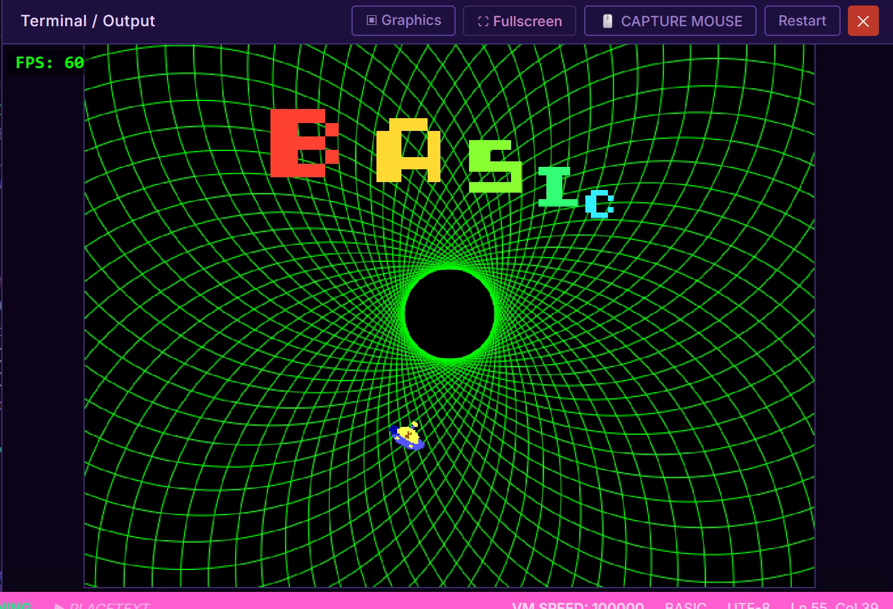

# basicFusion
Trying some basic programming using the [basicFusion app/website](https://www.basicfusion.org/)

## A first test

Using the built-in Spriteshop and retro font editor

Run and view the code using this link:
[https://basicfusion.org/index.html?open=cloud/2d186f43](https://basicfusion.org/index.html?open=cloud/2d186f43)

A still image from the animation:

The code:
[tube.bf](tube.bf)
